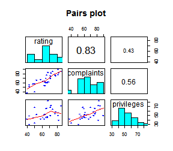
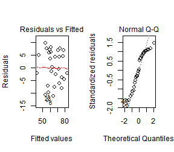
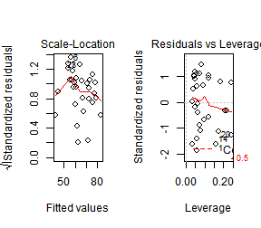
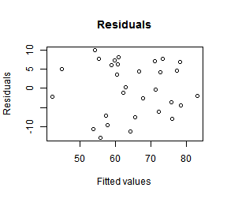
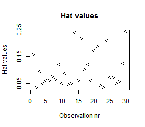

## Linear Regression Model Explorer

Use LRM Explorer (LRME) to quickly explore a data set, apply a linear regression model and obtain various summary statistics.

Features:
- Load and/or select data set
- View data summary
- Create linear regression model
- View model diagnostics 

Model formula: Response ~ Predictor(s) + Interaction(s) + Intercept

--- .class #id 

## Data analysis

Built-in data sets (no upload needed): attitude, ChickWeight, mtcars

Data set provided by user: "well formatted" csv file
- Should not need transcoding or format changes, has header row, variables that are numeric or can be converted to numeric
- After uploading select data set "uploaded data"

Statistics:
- Data counts: row, cols, NA values
- Variable summaries: min, max, median, mean, quantiles, NA
- Plots: Histogram, box plot (non-numeric variables will be coerced to numeric in the plot)

--- .class #id 

## Modeling

Formula: Response ~ Predictor(s) + Interaction(s) + Intercept

Create linear regression model:
- Select response variable (numerical), predictors (numerical or categorical) and any interactions.
- Indicate if regression is to be performed with or without intercept.
- Transformations and higher order (polynomial) predictors not supported.

Model parameters, statistics and diagnostics:
- Coefficients and confidence intervals
- RSE, R squared, F-statistic, DF
- Plots: pairs, diagnostic plot grid, residuals to fitted, hat values

--- .class #id 

## Sample plots

Formula: rating ~ complaints + privileges (in attitude data set)

     

